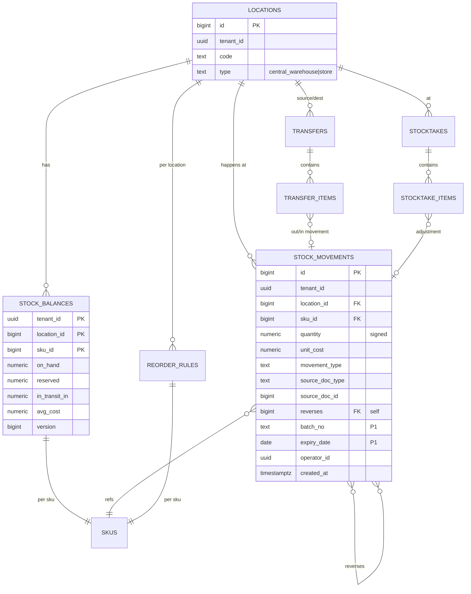

# 庫存模組 DB Schema v0.1

> 對應 [[PRD-庫存模組]] v0.1。
> 目標資料庫：**PostgreSQL 15+ / Supabase**。
> 純 DDL 檔：[[sql/inventory_schema]]（`docs/sql/inventory_schema.sql`）。

---

## 1. 設計原則

| 原則 | 說明 |
|---|---|
| **單一真相** | 所有庫存變動必經 `stock_movements`，`stock_balances` 是其物化視圖 |
| **Append-only** | `stock_movements` 不可 UPDATE / DELETE；更正必須寫反向異動 |
| **有號數量** | movement.quantity 用有號數字（+入、-出），不用 type 判斷正負 |
| **多租戶** | 每表都有 `tenant_id`，v1 只有 1 tenant 但 RLS 與索引已考量 |
| **併發安全** | balance 有 `version` 欄做樂觀鎖；扣庫存走 `SELECT FOR UPDATE` + trigger |
| **來源可追溯** | movement 必記 `source_doc_type` + `source_doc_id` |
| **精度** | 數量 `NUMERIC(18,3)`（支援小數 3 位，適合散裝 / 重量）；成本 `NUMERIC(18,4)` |
| **時區** | 一律 `TIMESTAMPTZ`，前端顯示轉台北時區 |

---

## 2. ERD（Mermaid）



---

## 3. 資料表清單

| # | 表名 | 角色 | 預估量級 |
|---|---|---|---|
| 1 | `locations` | 倉別（總倉 + 100 門市） | ~110 |
| 2 | `stock_balances` | 結存（物化） | ~15k × 101 ≈ 1.5M |
| 3 | `stock_movements` | 異動 log（核心） | 年增 ~10M+，partition 待 P1 |
| 4 | `transfers` | 調撥單頭 | 年增 ~50k |
| 5 | `transfer_items` | 調撥明細 | 年增 ~500k |
| 6 | `stocktakes` | 盤點單頭 | 年增 ~5k |
| 7 | `stocktake_items` | 盤點明細 | 年增 ~500k |
| 8 | `reorder_rules` | 補貨規則 | ~15k × 101 ≈ 1.5M |

---

## 4. 關鍵決策與替代方案

### 4.1 成本法：移動平均 vs FIFO
- **選擇**：移動平均（Moving Average），存於 `stock_balances.avg_cost`
- **理由**：實作簡單、查詢快、零售業普遍接受；FIFO 需維護批次層級，複雜度高 3 倍
- **替代方案**：未來轉 FIFO → 新增 `stock_batch_balances` 表（P2）
- **影響**：每筆入庫 trigger 重算 avg_cost（公式見 §7）

### 4.2 balance 維護：trigger vs 應用層
- **選擇**：Postgres trigger（`stock_movements INSERT → stock_balances UPDATE`）
- **理由**：保證原子性、所有寫入端（多服務 / 批次工作）都一致
- **替代方案**：應用層維護 → 容易漏更新、難除錯
- **風險**：trigger 讓 debug 較難；以嚴格命名 + 完整 log 緩解

### 4.3 Append-only：硬禁止 UPDATE/DELETE
- **選擇**：BEFORE UPDATE / DELETE trigger 拋例外
- **Supabase 搭配**：service_role 也受限；真要修只能 DBA 手動關 trigger
- **更正機制**：寫反向異動，自鏈 `reverses` / `reversed_by`

### 4.4 負庫存
- **選擇**：**DB 層允許**、**應用層預設阻擋**
- **理由**：特殊情境（事後補單、跨期）需要暫時負數；應用層用 RPC 檢核
- **實作**：check constraint 不加 `on_hand >= 0`；扣庫存 RPC 檢查 + `allow_negative` 參數

### 4.5 分區（Partitioning）
- **v0.1 不做**：1.5M ~ 10M 資料 Postgres 能輕鬆處理
- **P1 觸發條件**：`stock_movements` 超過 5000 萬筆 → 按月分區（`PARTITION BY RANGE (created_at)`）

### 4.6 BIGINT 主鍵 vs UUID
- **選擇**：內部 PK 用 `BIGSERIAL`，`tenant_id` / `operator_id` 用 UUID（對 Supabase auth 友好）
- **理由**：大表 BIGINT 效能與索引空間占優；UUID 只用在跨系統邊界

---

## 5. 資料類型與欄位規範

| 類型 | 用法 |
|---|---|
| `UUID` | `tenant_id`, `operator_id`（對應 Supabase auth.users） |
| `BIGINT` | 內部 FK（`location_id`, `sku_id`, movement id） |
| `TEXT` | 編號、名稱、狀態列舉（以 CHECK 約束） |
| `NUMERIC(18,3)` | 數量（支援小數 3 位，散裝 / 重量） |
| `NUMERIC(18,4)` | 單位成本、金額 |
| `TIMESTAMPTZ` | 所有時間欄位 |
| `DATE` | 效期 |
| `JSONB` | 備用 metadata（目前未使用） |

**不使用**：`FLOAT`/`DOUBLE`（精度）、`SERIAL`（改 `BIGSERIAL`）、`TIMESTAMP`（無時區）

---

## 6. DDL（完整，可直接執行）

```sql
-- ============================================
-- Inventory Module Schema v0.1
-- PostgreSQL 15+ / Supabase
-- ============================================

-- ---------- 1. 倉別 ----------
CREATE TABLE locations (
  id          BIGSERIAL PRIMARY KEY,
  tenant_id   UUID NOT NULL,
  code        TEXT NOT NULL,
  name        TEXT NOT NULL,
  type        TEXT NOT NULL CHECK (type IN ('central_warehouse','store')),
  address     TEXT,
  is_active   BOOLEAN NOT NULL DEFAULT TRUE,
  created_at  TIMESTAMPTZ NOT NULL DEFAULT NOW(),
  updated_at  TIMESTAMPTZ NOT NULL DEFAULT NOW(),
  UNIQUE (tenant_id, code)
);
COMMENT ON TABLE locations IS '倉別：總倉 + 門市';

-- ---------- 2. 庫存結存 ----------
CREATE TABLE stock_balances (
  tenant_id         UUID NOT NULL,
  location_id       BIGINT NOT NULL REFERENCES locations(id),
  sku_id            BIGINT NOT NULL,
  on_hand           NUMERIC(18,3) NOT NULL DEFAULT 0,
  reserved          NUMERIC(18,3) NOT NULL DEFAULT 0,
  in_transit_in     NUMERIC(18,3) NOT NULL DEFAULT 0,
  avg_cost          NUMERIC(18,4) NOT NULL DEFAULT 0,
  version           BIGINT NOT NULL DEFAULT 0,
  last_movement_at  TIMESTAMPTZ,
  updated_at        TIMESTAMPTZ NOT NULL DEFAULT NOW(),
  PRIMARY KEY (tenant_id, location_id, sku_id)
);
COMMENT ON TABLE stock_balances IS '庫存結存（movements 的物化視圖）';
COMMENT ON COLUMN stock_balances.in_transit_in IS '本倉「已發貨未收貨」的在途入量';
COMMENT ON COLUMN stock_balances.version IS '樂觀鎖版本';

-- ---------- 3. 庫存異動（核心 append-only）----------
CREATE TABLE stock_movements (
  id                    BIGSERIAL PRIMARY KEY,
  tenant_id             UUID NOT NULL,
  location_id           BIGINT NOT NULL REFERENCES locations(id),
  sku_id                BIGINT NOT NULL,
  quantity              NUMERIC(18,3) NOT NULL CHECK (quantity <> 0),
  unit_cost             NUMERIC(18,4),
  movement_type         TEXT NOT NULL CHECK (movement_type IN (
                          'purchase_receipt',
                          'return_to_supplier',
                          'sale',
                          'customer_return',
                          'transfer_out',
                          'transfer_in',
                          'stocktake_gain',
                          'stocktake_loss',
                          'damage',
                          'manual_adjust',
                          'reversal'
                        )),
  source_doc_type       TEXT,
  source_doc_id         BIGINT,
  source_doc_line_id    BIGINT,
  reverses              BIGINT REFERENCES stock_movements(id),
  reversed_by           BIGINT REFERENCES stock_movements(id),
  batch_no              TEXT,
  expiry_date           DATE,
  reason                TEXT,
  operator_id           UUID NOT NULL,
  operator_ip           INET,
  notes                 TEXT,
  created_at            TIMESTAMPTZ NOT NULL DEFAULT NOW()
);
COMMENT ON TABLE stock_movements IS '庫存異動紀錄（append-only，不可更新刪除）';
COMMENT ON COLUMN stock_movements.quantity IS '有號：+入 / -出';

-- ---------- 4. 調撥單 ----------
CREATE TABLE transfers (
  id                BIGSERIAL PRIMARY KEY,
  tenant_id         UUID NOT NULL,
  transfer_no       TEXT NOT NULL,
  source_location   BIGINT NOT NULL REFERENCES locations(id),
  dest_location     BIGINT NOT NULL REFERENCES locations(id),
  status            TEXT NOT NULL DEFAULT 'draft' CHECK (status IN (
                      'draft','confirmed','shipped','received','cancelled','closed'
                    )),
  requested_by      UUID,
  shipped_by        UUID,
  shipped_at        TIMESTAMPTZ,
  received_by       UUID,
  received_at       TIMESTAMPTZ,
  notes             TEXT,
  created_at        TIMESTAMPTZ NOT NULL DEFAULT NOW(),
  updated_at        TIMESTAMPTZ NOT NULL DEFAULT NOW(),
  UNIQUE (tenant_id, transfer_no),
  CHECK (source_location <> dest_location)
);

CREATE TABLE transfer_items (
  id               BIGSERIAL PRIMARY KEY,
  transfer_id      BIGINT NOT NULL REFERENCES transfers(id) ON DELETE CASCADE,
  sku_id           BIGINT NOT NULL,
  qty_requested    NUMERIC(18,3) NOT NULL CHECK (qty_requested > 0),
  qty_shipped      NUMERIC(18,3) NOT NULL DEFAULT 0,
  qty_received     NUMERIC(18,3) NOT NULL DEFAULT 0,
  qty_variance     NUMERIC(18,3) GENERATED ALWAYS AS (qty_received - qty_shipped) STORED,
  out_movement_id  BIGINT REFERENCES stock_movements(id),
  in_movement_id   BIGINT REFERENCES stock_movements(id),
  notes            TEXT
);

-- ---------- 5. 盤點單 ----------
CREATE TABLE stocktakes (
  id            BIGSERIAL PRIMARY KEY,
  tenant_id     UUID NOT NULL,
  stocktake_no  TEXT NOT NULL,
  location_id   BIGINT NOT NULL REFERENCES locations(id),
  type          TEXT NOT NULL CHECK (type IN ('full','partial','cycle')),
  status        TEXT NOT NULL DEFAULT 'draft' CHECK (status IN (
                  'draft','counting','review','adjusted','cancelled'
                )),
  freeze_trx    BOOLEAN NOT NULL DEFAULT FALSE,
  started_at    TIMESTAMPTZ,
  completed_at  TIMESTAMPTZ,
  created_by    UUID NOT NULL,
  notes         TEXT,
  created_at    TIMESTAMPTZ NOT NULL DEFAULT NOW(),
  UNIQUE (tenant_id, stocktake_no)
);

CREATE TABLE stocktake_items (
  id                      BIGSERIAL PRIMARY KEY,
  stocktake_id            BIGINT NOT NULL REFERENCES stocktakes(id) ON DELETE CASCADE,
  sku_id                  BIGINT NOT NULL,
  system_qty              NUMERIC(18,3) NOT NULL,
  counted_qty             NUMERIC(18,3),
  diff_qty                NUMERIC(18,3) GENERATED ALWAYS AS (counted_qty - system_qty) STORED,
  adjustment_movement_id  BIGINT REFERENCES stock_movements(id),
  counted_by              UUID,
  counted_at              TIMESTAMPTZ,
  notes                   TEXT
);

-- ---------- 6. 補貨規則 ----------
CREATE TABLE reorder_rules (
  tenant_id       UUID NOT NULL,
  location_id     BIGINT NOT NULL REFERENCES locations(id),
  sku_id          BIGINT NOT NULL,
  safety_stock    NUMERIC(18,3) NOT NULL DEFAULT 0,
  reorder_point   NUMERIC(18,3) NOT NULL DEFAULT 0,
  max_stock       NUMERIC(18,3),
  lead_time_days  INTEGER,
  updated_by      UUID,
  updated_at      TIMESTAMPTZ NOT NULL DEFAULT NOW(),
  PRIMARY KEY (tenant_id, location_id, sku_id),
  CHECK (reorder_point >= safety_stock),
  CHECK (max_stock IS NULL OR max_stock >= reorder_point)
);
```

---

## 7. Trigger：Movement → Balance 自動維護

```sql
CREATE OR REPLACE FUNCTION apply_movement_to_balance()
RETURNS TRIGGER AS $$
DECLARE
  v_cur RECORD;
  v_new_on_hand NUMERIC(18,3);
  v_new_avg_cost NUMERIC(18,4);
BEGIN
  -- 確保 balance 列存在
  INSERT INTO stock_balances (tenant_id, location_id, sku_id)
  VALUES (NEW.tenant_id, NEW.location_id, NEW.sku_id)
  ON CONFLICT DO NOTHING;

  -- 鎖列
  SELECT * INTO v_cur
    FROM stock_balances
   WHERE tenant_id = NEW.tenant_id
     AND location_id = NEW.location_id
     AND sku_id = NEW.sku_id
   FOR UPDATE;

  v_new_on_hand := v_cur.on_hand + NEW.quantity;

  -- 移動平均：僅「入庫且含單價」重算
  IF NEW.quantity > 0 AND NEW.unit_cost IS NOT NULL AND NEW.unit_cost > 0
     AND (v_cur.on_hand + NEW.quantity) > 0 THEN
    v_new_avg_cost := (v_cur.on_hand * v_cur.avg_cost + NEW.quantity * NEW.unit_cost)
                    / (v_cur.on_hand + NEW.quantity);
  ELSE
    v_new_avg_cost := v_cur.avg_cost;
  END IF;

  UPDATE stock_balances
     SET on_hand = v_new_on_hand,
         avg_cost = v_new_avg_cost,
         version = v_cur.version + 1,
         last_movement_at = NEW.created_at,
         updated_at = NOW()
   WHERE tenant_id = NEW.tenant_id
     AND location_id = NEW.location_id
     AND sku_id = NEW.sku_id;

  RETURN NEW;
END;
$$ LANGUAGE plpgsql;

CREATE TRIGGER trg_apply_movement
AFTER INSERT ON stock_movements
FOR EACH ROW EXECUTE FUNCTION apply_movement_to_balance();

-- 禁 UPDATE / DELETE
CREATE OR REPLACE FUNCTION forbid_movement_mutation()
RETURNS TRIGGER AS $$
BEGIN
  RAISE EXCEPTION 'stock_movements is append-only. Use a reversing entry instead.';
END;
$$ LANGUAGE plpgsql;

CREATE TRIGGER trg_no_update_mov BEFORE UPDATE ON stock_movements
  FOR EACH ROW EXECUTE FUNCTION forbid_movement_mutation();
CREATE TRIGGER trg_no_delete_mov BEFORE DELETE ON stock_movements
  FOR EACH ROW EXECUTE FUNCTION forbid_movement_mutation();
```

---

## 8. 索引策略

```sql
-- stock_movements 熱點查詢
CREATE INDEX idx_mov_tloc_sku_time
  ON stock_movements (tenant_id, location_id, sku_id, created_at DESC);

CREATE INDEX idx_mov_source
  ON stock_movements (source_doc_type, source_doc_id)
  WHERE source_doc_id IS NOT NULL;

CREATE INDEX idx_mov_time
  ON stock_movements (tenant_id, created_at DESC);

-- stock_balances：查某倉所有庫存 > 0 的 SKU
CREATE INDEX idx_bal_tloc
  ON stock_balances (tenant_id, location_id)
  WHERE on_hand <> 0;

-- transfers 狀態看板
CREATE INDEX idx_transfers_status
  ON transfers (tenant_id, status, created_at DESC);
CREATE INDEX idx_transfers_dest_status
  ON transfers (dest_location, status);

-- stocktakes
CREATE INDEX idx_stocktakes_loc_status
  ON stocktakes (tenant_id, location_id, status);
```

---

## 9. RLS（Row-Level Security，多租戶 + 門市隔離）

```sql
-- 啟用 RLS
ALTER TABLE locations         ENABLE ROW LEVEL SECURITY;
ALTER TABLE stock_balances    ENABLE ROW LEVEL SECURITY;
ALTER TABLE stock_movements   ENABLE ROW LEVEL SECURITY;
ALTER TABLE transfers         ENABLE ROW LEVEL SECURITY;
ALTER TABLE transfer_items    ENABLE ROW LEVEL SECURITY;
ALTER TABLE stocktakes        ENABLE ROW LEVEL SECURITY;
ALTER TABLE stocktake_items   ENABLE ROW LEVEL SECURITY;
ALTER TABLE reorder_rules     ENABLE ROW LEVEL SECURITY;

-- 範例：假設 JWT claim 含 tenant_id, role, location_id
-- 總部角色：看本 tenant 全部
CREATE POLICY hq_full_read ON stock_balances
  FOR SELECT USING (
    tenant_id = (auth.jwt() ->> 'tenant_id')::uuid
    AND (auth.jwt() ->> 'role') IN ('owner','purchaser','warehouse','reporter')
  );

-- 門市角色：只看自己的 location
CREATE POLICY store_read_own ON stock_balances
  FOR SELECT USING (
    tenant_id = (auth.jwt() ->> 'tenant_id')::uuid
    AND (auth.jwt() ->> 'role') IN ('store_manager','clerk')
    AND location_id = (auth.jwt() ->> 'location_id')::bigint
  );

-- 寫入：一律走 RPC（SECURITY DEFINER），RLS 僅控讀
```

> **建議寫入路徑**：全部經 RPC（`rpc_inbound(...)`, `rpc_outbound(...)`, `rpc_transfer_ship(...)`, `rpc_stocktake_adjust(...)`），RPC 內部以 `SECURITY DEFINER` 執行並驗證權限 + 建立 movement，不直接開放 INSERT。

---

## 10. 關鍵寫入 RPC 範例

```sql
-- 入庫（採購收貨 / 顧客退貨 / 盤盈）
CREATE OR REPLACE FUNCTION rpc_inbound(
  p_tenant_id UUID,
  p_location_id BIGINT,
  p_sku_id BIGINT,
  p_quantity NUMERIC,
  p_unit_cost NUMERIC,
  p_movement_type TEXT,
  p_source_doc_type TEXT,
  p_source_doc_id BIGINT,
  p_operator UUID
) RETURNS BIGINT AS $$
DECLARE
  v_id BIGINT;
BEGIN
  IF p_quantity <= 0 THEN
    RAISE EXCEPTION 'Inbound quantity must be positive';
  END IF;

  INSERT INTO stock_movements
    (tenant_id, location_id, sku_id, quantity, unit_cost, movement_type,
     source_doc_type, source_doc_id, operator_id)
  VALUES
    (p_tenant_id, p_location_id, p_sku_id, p_quantity, p_unit_cost, p_movement_type,
     p_source_doc_type, p_source_doc_id, p_operator)
  RETURNING id INTO v_id;

  RETURN v_id;
END;
$$ LANGUAGE plpgsql SECURITY DEFINER;

-- 出庫（POS 銷售 / 報廢 / 盤虧），內含可用庫存檢查
CREATE OR REPLACE FUNCTION rpc_outbound(
  p_tenant_id UUID,
  p_location_id BIGINT,
  p_sku_id BIGINT,
  p_quantity NUMERIC,
  p_movement_type TEXT,
  p_source_doc_type TEXT,
  p_source_doc_id BIGINT,
  p_operator UUID,
  p_allow_negative BOOLEAN DEFAULT FALSE
) RETURNS BIGINT AS $$
DECLARE
  v_available NUMERIC;
  v_cost NUMERIC;
  v_id BIGINT;
BEGIN
  IF p_quantity <= 0 THEN
    RAISE EXCEPTION 'Outbound quantity must be positive (will be stored as negative)';
  END IF;

  SELECT on_hand - reserved, avg_cost
    INTO v_available, v_cost
    FROM stock_balances
   WHERE tenant_id = p_tenant_id
     AND location_id = p_location_id
     AND sku_id = p_sku_id
   FOR UPDATE;

  IF NOT FOUND THEN
    v_available := 0; v_cost := 0;
  END IF;

  IF v_available < p_quantity AND NOT p_allow_negative THEN
    RAISE EXCEPTION 'Insufficient stock: available=%, required=%', v_available, p_quantity;
  END IF;

  INSERT INTO stock_movements
    (tenant_id, location_id, sku_id, quantity, unit_cost, movement_type,
     source_doc_type, source_doc_id, operator_id)
  VALUES
    (p_tenant_id, p_location_id, p_sku_id, -p_quantity, v_cost, p_movement_type,
     p_source_doc_type, p_source_doc_id, p_operator)
  RETURNING id INTO v_id;

  RETURN v_id;
END;
$$ LANGUAGE plpgsql SECURITY DEFINER;
```

---

## 11. 常見查詢

```sql
-- 1. 單店某 SKU 即時庫存
SELECT on_hand, reserved, in_transit_in, (on_hand - reserved) AS available, avg_cost
FROM stock_balances
WHERE tenant_id = $1 AND location_id = $2 AND sku_id = $3;

-- 2. 全集團某 SKU 分佈
SELECT l.code AS location, b.on_hand, b.in_transit_in
FROM stock_balances b
JOIN locations l ON l.id = b.location_id
WHERE b.tenant_id = $1 AND b.sku_id = $2
ORDER BY l.type DESC, l.code;

-- 3. 低於補貨點
SELECT r.location_id, r.sku_id, b.on_hand, r.reorder_point, r.safety_stock
FROM reorder_rules r
JOIN stock_balances b USING (tenant_id, location_id, sku_id)
WHERE r.tenant_id = $1 AND b.on_hand <= r.reorder_point;

-- 4. 某 SKU 某期間全異動 timeline
SELECT id, created_at, location_id, quantity, movement_type, source_doc_type, source_doc_id, unit_cost
FROM stock_movements
WHERE tenant_id = $1 AND sku_id = $2
  AND created_at BETWEEN $3 AND $4
ORDER BY created_at;

-- 5. 滯銷清單（30 天無異動）
SELECT b.location_id, b.sku_id, b.on_hand, b.last_movement_at
FROM stock_balances b
WHERE b.tenant_id = $1
  AND b.on_hand > 0
  AND (b.last_movement_at IS NULL OR b.last_movement_at < NOW() - INTERVAL '30 days');
```

---

## 12. 併發與超賣防護

- [ ] 所有出庫走 `rpc_outbound`，函式內 `SELECT ... FOR UPDATE` 鎖住 balance 列
- [ ] POS 多支同時打 `rpc_outbound` 同一 SKU → Postgres 自動排隊，一筆成功一筆回錯
- [ ] 調撥「出貨」同樣鎖來源 balance；「收貨」鎖目的 balance
- [ ] 盤點凍結（`freeze_trx = true`）：在 RPC 前置檢查中擋住該 location 的一般異動

---

## 13. 資料遷移（舊系統 → 新 Schema）

建議路徑：
1. 匯入 `locations`、`skus`（主檔先行）
2. 以**開帳**方式匯入初始庫存：每個 `(location, sku)` 產生一筆 `movement_type = 'manual_adjust'`（reason = 'opening_balance'），quantity = 舊系統庫存數
3. Trigger 自動建 `stock_balances`
4. 舊歷史 movement 不搬，保留舊系統查詢介面 + 在新系統存「舊系統連結」

---

## 14. Open Questions（影響 Schema 的決策）
- [ ] 成本法最終確認：移動平均（目前設計）vs FIFO（需新增批次表）
- [ ] 批號 / 效期 v1 就要 → 本 schema 已預留 `batch_no`/`expiry_date` 欄位；但 balance 是否要細到批次？（若是：v1 就要新增 `stock_batch_balances`）
- [ ] 是否要 `stock_reservations` 表（單獨管理預留而非只存 balance.reserved 總量）→ 有電商才需要
- [ ] 單位換算（個 / 盒 / 箱）要在本模組還是條碼模組處理？
- [ ] 是否保留盤點前的 balance 快照（供 audit）→ 目前靠 `stocktake_items.system_qty`，是否足夠？

---

## 15. 下一步
- [ ] 把本 schema 套用到 Supabase dev 環境
- [ ] 寫 seed 資料（1 tenant + 2 location + 5 SKU + 10 movements）測試 trigger
- [ ] 寫 RPC 單元測試：併發扣庫存、反向異動、調撥完整流程
- [ ] 效能測試：灌 100 萬筆 movements 看查詢延遲
- [ ] 回答 §14 Open Questions → v0.2 schema

---

## 相關連結
- [[PRD-庫存模組]]
- [[PRD-採購模組]] — 採購收貨會呼叫本模組入庫 RPC
- [[PRD-條碼模組]] — 掃碼查庫存 / 扣庫存
- 純 DDL：`docs/sql/inventory_schema.sql`
