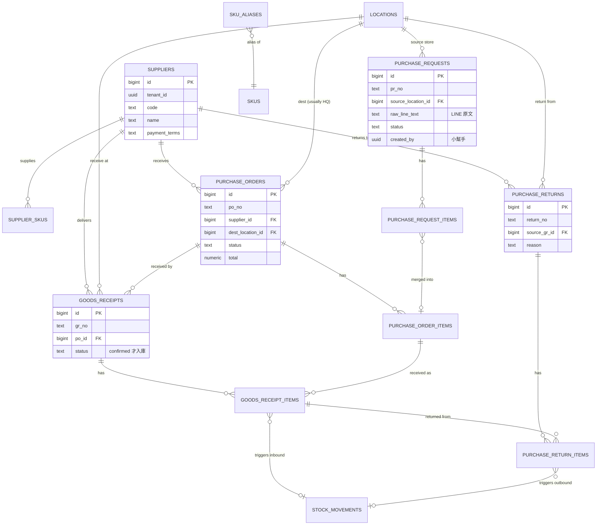

# 進貨模組 DB Schema v0.1

> 對應 [[PRD-採購模組]] v0.1。
> 與 [[DB-庫存模組]] 同一個 DB，共用 `locations`、`stock_movements` RPC。
> 純 DDL：`docs/sql/purchase_schema.sql`

---

## 1. 涵蓋範圍

本模組負責「從 LINE 叫貨 → 採購 → 收貨 → 退供 → 對帳」的完整單據流，**不**負責庫存結存（交給庫存模組）。

主要業務事件與歸屬：

| 業務事件 | 本模組的單據 | 庫存怎麼動 |
|---|---|---|
| 小幫手 key LINE 叫貨 | `purchase_requests (PR)` | 不動庫存 |
| 採購合併 PR → 發給供應商 | `purchase_orders (PO)` | 不動庫存 |
| 總倉收貨 | `goods_receipts (GR)` | 確認後呼叫 `rpc_inbound` |
| 退給供應商 | `purchase_returns` | 確認後呼叫 `rpc_outbound` |

---

## 2. 設計原則（沿用庫存模組慣例 + 本模組特有）

| 原則 | 說明 |
|---|---|
| **PR / PO / GR / Return 皆為獨立單據** | 不強制 1:1，PR 可多對一合併為 PO；PO 可分多次 GR |
| **單據不動庫存** | 唯有 **GR 確認** 與 **退供確認** 才寫入 `stock_movements` |
| **源單據可追溯** | GR → PO → PR，每一層都保留上游 id |
| **LINE 原文保留** | `purchase_requests.raw_line_text`（整段）+ 每個 item 的 `raw_line`（該行） |
| **LINE 解析回饋** | `sku_aliases` 表紀錄小幫手修正過的別名 → 下次自動識別 |
| **單價一致性** | GR item 的 `unit_cost` 優先取自 GR 實填，若無則 fallback 到 PO item |
| **稅金** | 5% 台灣營業稅於 line-level 計算，header 聚合 |

---

## 3. ERD（Mermaid）



---

## 4. 資料表清單

| # | 表名 | 角色 | 預估量級 |
|---|---|---|---|
| 1 | `suppliers` | 供應商主檔 | ~200 |
| 2 | `supplier_skus` | 供應商 ↔ SKU + 預設價 | ~15k |
| 3 | `sku_aliases` | 商品別名（LINE 解析關鍵）| ~30k+（持續增長） |
| 4 | `purchase_requests` | 請購單（LINE 叫貨）| 年增 ~50k |
| 5 | `purchase_request_items` | 請購明細 | 年增 ~500k |
| 6 | `purchase_orders` | 採購單 | 年增 ~20k |
| 7 | `purchase_order_items` | 採購明細 | 年增 ~200k |
| 8 | `goods_receipts` | 收貨單 | 年增 ~30k |
| 9 | `goods_receipt_items` | 收貨明細 | 年增 ~300k |
| 10 | `purchase_returns` | 退供單 | 年增 ~2k |
| 11 | `purchase_return_items` | 退供明細 | 年增 ~20k |

---

## 5. 單據狀態機

```
PR:  draft ─► submitted ─► partially_ordered ─► fully_ordered
                    │                                  
                    └─► cancelled                      

PO:  draft ─► sent ─► partially_received ─► fully_received ─► closed
       │                                                          
       └─► cancelled                                               

GR:  draft ─► confirmed   (confirmed 才觸發 rpc_inbound)
       │
       └─► cancelled

退供: draft ─► confirmed ─► shipped ─► completed
       │        (此時呼叫 rpc_outbound)
       └─► cancelled
```

---

## 6. 關鍵決策

### 6.1 PR 與 PO 的關係：多對多還是一對多？
- **選擇**：一對多（PR item → 一個 PO item），用 `purchase_request_items.po_item_id` 記關係
- **理由**：實務上小幫手不會把「半個 PR item」拆到不同 PO；複雜度不值得
- **替代**：若真需要拆分 → 未來加 `purchase_request_po_links` junction 表（P2）

### 6.2 GR 必須掛 PO 嗎？
- **選擇**：**必須**（`goods_receipts.po_id NOT NULL`）
- **理由**：無單收貨容易造成資料污染；緊急情境另走「補建 PO」流程
- **例外**：若業務堅持要「先收貨再補 PO」→ 改為 nullable，但需 P1 做稽核報表追蹤

### 6.3 GR item 的單價來源
- **選擇**：`unit_cost NOT NULL`，預設帶 PO 的 `unit_cost`，倉管可改
- **理由**：實際到貨價可能因促銷/議價與 PO 不同，以實收為準
- **影響**：移動平均成本用 GR 的 `unit_cost`，不用 PO 的

### 6.4 稅金儲存
- **選擇**：line-level 存 `unit_cost`（未稅）+ `tax_rate`；header 存聚合 `subtotal / tax / total`
- **理由**：方便未來不同品項適用不同稅率（零稅率、免稅）
- **台灣預設**：`tax_rate = 0.05`

### 6.5 PO 送出後不可改
- **選擇**：`status = 'sent'` 後 trigger 擋住 `purchase_order_items` 的 UPDATE / DELETE
- **替代**：需要改 → 建「修改單」或取消重開 PO

### 6.6 sku_aliases 設計
- **選擇**：`(tenant_id, alias) UNIQUE`，一個別名只對應一個 SKU
- **理由**：LINE 解析明確；若同別名指多 SKU → 解析無法決定，不支援
- **成長機制**：小幫手每次「把未識別行綁到 SKU」→ 自動寫入 alias

---

## 7. DDL（完整）

```sql
-- ============================================
-- Purchase / Inbound Module Schema v0.1
-- 需先建好 inventory_schema.sql（依賴 locations, stock_movements, rpc_inbound, rpc_outbound）
-- ============================================

-- ---------- 1. 供應商 ----------
CREATE TABLE suppliers (
  id              BIGSERIAL PRIMARY KEY,
  tenant_id       UUID NOT NULL,
  code            TEXT NOT NULL,
  name            TEXT NOT NULL,
  tax_id          TEXT,
  contact_name    TEXT,
  phone           TEXT,
  email           TEXT,
  address         TEXT,
  payment_terms   TEXT,                         -- 'net30','net60','cod','prepaid'
  lead_time_days  INTEGER,
  is_active       BOOLEAN NOT NULL DEFAULT TRUE,
  notes           TEXT,
  created_at      TIMESTAMPTZ NOT NULL DEFAULT NOW(),
  updated_at      TIMESTAMPTZ NOT NULL DEFAULT NOW(),
  UNIQUE (tenant_id, code)
);
COMMENT ON TABLE suppliers IS '供應商主檔';

-- ---------- 2. 供應商 ↔ SKU ----------
CREATE TABLE supplier_skus (
  tenant_id          UUID NOT NULL,
  supplier_id        BIGINT NOT NULL REFERENCES suppliers(id) ON DELETE CASCADE,
  sku_id             BIGINT NOT NULL,
  supplier_sku_code  TEXT,
  default_unit_cost  NUMERIC(18,4),
  pack_qty           NUMERIC(18,3) NOT NULL DEFAULT 1,
  is_preferred       BOOLEAN NOT NULL DEFAULT FALSE,
  last_purchased_at  TIMESTAMPTZ,
  notes              TEXT,
  PRIMARY KEY (tenant_id, supplier_id, sku_id)
);
COMMENT ON COLUMN supplier_skus.pack_qty IS '供應商出貨單位，例如 1 箱 = 12';
COMMENT ON COLUMN supplier_skus.is_preferred IS '同 SKU 多供應商時的優先';

-- ---------- 3. 商品別名（LINE 解析關鍵表） ----------
CREATE TABLE sku_aliases (
  id          BIGSERIAL PRIMARY KEY,
  tenant_id   UUID NOT NULL,
  sku_id      BIGINT NOT NULL,
  alias       TEXT NOT NULL,
  source      TEXT NOT NULL CHECK (source IN ('line_parsing','manual','supplier_name','historical')),
  created_by  UUID,
  created_at  TIMESTAMPTZ NOT NULL DEFAULT NOW(),
  UNIQUE (tenant_id, alias)
);
COMMENT ON TABLE sku_aliases IS 'LINE 文字解析用：一個別名對應一個 SKU，不可一對多';

-- ---------- 4. 採購單（必須先建，PR 會引用） ----------
CREATE TABLE purchase_orders (
  id                BIGSERIAL PRIMARY KEY,
  tenant_id         UUID NOT NULL,
  po_no             TEXT NOT NULL,
  supplier_id       BIGINT NOT NULL REFERENCES suppliers(id),
  dest_location_id  BIGINT NOT NULL REFERENCES locations(id),
  status            TEXT NOT NULL DEFAULT 'draft' CHECK (status IN (
                      'draft','sent','partially_received','fully_received','closed','cancelled'
                    )),
  order_date        DATE NOT NULL DEFAULT CURRENT_DATE,
  expected_date     DATE,
  subtotal          NUMERIC(18,2) NOT NULL DEFAULT 0,
  tax               NUMERIC(18,2) NOT NULL DEFAULT 0,
  total             NUMERIC(18,2) NOT NULL DEFAULT 0,
  payment_terms     TEXT,
  created_by        UUID NOT NULL,
  sent_at           TIMESTAMPTZ,
  sent_by           UUID,
  sent_channel      TEXT,                        -- 'email','line','print','manual'
  notes             TEXT,
  created_at        TIMESTAMPTZ NOT NULL DEFAULT NOW(),
  updated_at        TIMESTAMPTZ NOT NULL DEFAULT NOW(),
  UNIQUE (tenant_id, po_no)
);

CREATE TABLE purchase_order_items (
  id             BIGSERIAL PRIMARY KEY,
  po_id          BIGINT NOT NULL REFERENCES purchase_orders(id) ON DELETE CASCADE,
  sku_id         BIGINT NOT NULL,
  qty_ordered    NUMERIC(18,3) NOT NULL CHECK (qty_ordered > 0),
  qty_received   NUMERIC(18,3) NOT NULL DEFAULT 0,
  qty_returned   NUMERIC(18,3) NOT NULL DEFAULT 0,
  unit_cost      NUMERIC(18,4) NOT NULL,
  tax_rate       NUMERIC(5,4) NOT NULL DEFAULT 0.05,
  line_subtotal  NUMERIC(18,2) GENERATED ALWAYS AS (qty_ordered * unit_cost) STORED,
  notes          TEXT
);

-- ---------- 5. 請購單（LINE 叫貨） ----------
CREATE TABLE purchase_requests (
  id                   BIGSERIAL PRIMARY KEY,
  tenant_id            UUID NOT NULL,
  pr_no                TEXT NOT NULL,
  source_location_id   BIGINT REFERENCES locations(id),
  raw_line_text        TEXT,                    -- LINE 記事本整段原文
  status               TEXT NOT NULL DEFAULT 'draft' CHECK (status IN (
                         'draft','submitted','partially_ordered','fully_ordered','cancelled'
                       )),
  created_by           UUID NOT NULL,           -- 小幫手
  submitted_at         TIMESTAMPTZ,
  notes                TEXT,
  created_at           TIMESTAMPTZ NOT NULL DEFAULT NOW(),
  updated_at           TIMESTAMPTZ NOT NULL DEFAULT NOW(),
  UNIQUE (tenant_id, pr_no)
);

CREATE TABLE purchase_request_items (
  id                     BIGSERIAL PRIMARY KEY,
  pr_id                  BIGINT NOT NULL REFERENCES purchase_requests(id) ON DELETE CASCADE,
  sku_id                 BIGINT NOT NULL,
  qty_requested          NUMERIC(18,3) NOT NULL CHECK (qty_requested > 0),
  suggested_supplier_id  BIGINT REFERENCES suppliers(id),
  raw_line               TEXT,                  -- 該品項原始 LINE 那一行
  parse_confidence       NUMERIC(4,3),          -- 0~1
  po_item_id             BIGINT REFERENCES purchase_order_items(id),
  notes                  TEXT
);

-- ---------- 6. 收貨單 ----------
CREATE TABLE goods_receipts (
  id                    BIGSERIAL PRIMARY KEY,
  tenant_id             UUID NOT NULL,
  gr_no                 TEXT NOT NULL,
  po_id                 BIGINT NOT NULL REFERENCES purchase_orders(id),
  supplier_id           BIGINT NOT NULL REFERENCES suppliers(id),
  dest_location_id      BIGINT NOT NULL REFERENCES locations(id),
  status                TEXT NOT NULL DEFAULT 'draft' CHECK (status IN ('draft','confirmed','cancelled')),
  receive_date          DATE NOT NULL DEFAULT CURRENT_DATE,
  supplier_invoice_no   TEXT,
  received_by           UUID NOT NULL,
  confirmed_at          TIMESTAMPTZ,
  confirmed_by          UUID,
  notes                 TEXT,
  created_at            TIMESTAMPTZ NOT NULL DEFAULT NOW(),
  updated_at            TIMESTAMPTZ NOT NULL DEFAULT NOW(),
  UNIQUE (tenant_id, gr_no)
);

CREATE TABLE goods_receipt_items (
  id                BIGSERIAL PRIMARY KEY,
  gr_id             BIGINT NOT NULL REFERENCES goods_receipts(id) ON DELETE CASCADE,
  po_item_id        BIGINT REFERENCES purchase_order_items(id),
  sku_id            BIGINT NOT NULL,
  qty_expected      NUMERIC(18,3),
  qty_received      NUMERIC(18,3) NOT NULL CHECK (qty_received > 0),
  qty_damaged       NUMERIC(18,3) NOT NULL DEFAULT 0,
  unit_cost         NUMERIC(18,4) NOT NULL,
  batch_no          TEXT,
  expiry_date       DATE,
  variance_reason   TEXT,
  movement_id       BIGINT REFERENCES stock_movements(id),
  notes             TEXT
);
COMMENT ON COLUMN goods_receipt_items.movement_id IS 'GR 確認後寫入：對應的 stock_movements.id';

-- ---------- 7. 退供單 ----------
CREATE TABLE purchase_returns (
  id                   BIGSERIAL PRIMARY KEY,
  tenant_id            UUID NOT NULL,
  return_no            TEXT NOT NULL,
  supplier_id          BIGINT NOT NULL REFERENCES suppliers(id),
  source_location_id   BIGINT NOT NULL REFERENCES locations(id),
  source_gr_id         BIGINT REFERENCES goods_receipts(id),
  status               TEXT NOT NULL DEFAULT 'draft' CHECK (status IN (
                         'draft','confirmed','shipped','completed','cancelled'
                       )),
  return_date          DATE NOT NULL DEFAULT CURRENT_DATE,
  reason               TEXT NOT NULL,
  created_by           UUID NOT NULL,
  confirmed_at         TIMESTAMPTZ,
  confirmed_by         UUID,
  notes                TEXT,
  created_at           TIMESTAMPTZ NOT NULL DEFAULT NOW(),
  updated_at           TIMESTAMPTZ NOT NULL DEFAULT NOW(),
  UNIQUE (tenant_id, return_no)
);

CREATE TABLE purchase_return_items (
  id            BIGSERIAL PRIMARY KEY,
  return_id     BIGINT NOT NULL REFERENCES purchase_returns(id) ON DELETE CASCADE,
  gr_item_id    BIGINT REFERENCES goods_receipt_items(id),
  sku_id        BIGINT NOT NULL,
  qty           NUMERIC(18,3) NOT NULL CHECK (qty > 0),
  unit_cost     NUMERIC(18,4) NOT NULL,
  reason        TEXT,
  movement_id   BIGINT REFERENCES stock_movements(id),
  notes         TEXT
);
```

---

## 8. 串接庫存：RPC 函式

這些函式是**本模組對外**的寫入入口，禁止直接 UPDATE/INSERT 這些表（除了 draft 狀態編輯）。

### 8.1 GR 確認 → 入庫

```sql
CREATE OR REPLACE FUNCTION rpc_confirm_gr(p_gr_id BIGINT, p_operator UUID)
RETURNS VOID AS $$
DECLARE
  v_gr RECORD;
  v_item RECORD;
  v_mov_id BIGINT;
BEGIN
  -- 鎖 GR
  SELECT * INTO v_gr FROM goods_receipts WHERE id = p_gr_id FOR UPDATE;
  IF v_gr.status <> 'draft' THEN
    RAISE EXCEPTION 'GR % is not in draft status (current: %)', p_gr_id, v_gr.status;
  END IF;

  -- 每一項呼叫 rpc_inbound（庫存模組）
  FOR v_item IN SELECT * FROM goods_receipt_items WHERE gr_id = p_gr_id LOOP
    v_mov_id := rpc_inbound(
      p_tenant_id       => v_gr.tenant_id,
      p_location_id     => v_gr.dest_location_id,
      p_sku_id          => v_item.sku_id,
      p_quantity        => v_item.qty_received,
      p_unit_cost       => v_item.unit_cost,
      p_movement_type   => 'purchase_receipt',
      p_source_doc_type => 'goods_receipt',
      p_source_doc_id   => p_gr_id,
      p_operator        => p_operator
    );

    -- 回寫 movement_id
    UPDATE goods_receipt_items SET movement_id = v_mov_id WHERE id = v_item.id;

    -- 若有關聯 PO item，累加 qty_received
    IF v_item.po_item_id IS NOT NULL THEN
      UPDATE purchase_order_items
         SET qty_received = qty_received + v_item.qty_received
       WHERE id = v_item.po_item_id;
    END IF;
  END LOOP;

  -- 更新 GR 狀態
  UPDATE goods_receipts
     SET status = 'confirmed', confirmed_at = NOW(), confirmed_by = p_operator, updated_at = NOW()
   WHERE id = p_gr_id;

  -- 更新 PO 狀態（partially / fully received）
  PERFORM _refresh_po_status(v_gr.po_id);
END;
$$ LANGUAGE plpgsql SECURITY DEFINER;
```

### 8.2 退供確認 → 出庫

```sql
CREATE OR REPLACE FUNCTION rpc_confirm_return(p_return_id BIGINT, p_operator UUID)
RETURNS VOID AS $$
DECLARE
  v_ret RECORD;
  v_item RECORD;
  v_mov_id BIGINT;
BEGIN
  SELECT * INTO v_ret FROM purchase_returns WHERE id = p_return_id FOR UPDATE;
  IF v_ret.status <> 'draft' THEN
    RAISE EXCEPTION 'Return % is not in draft status (current: %)', p_return_id, v_ret.status;
  END IF;

  FOR v_item IN SELECT * FROM purchase_return_items WHERE return_id = p_return_id LOOP
    v_mov_id := rpc_outbound(
      p_tenant_id       => v_ret.tenant_id,
      p_location_id     => v_ret.source_location_id,
      p_sku_id          => v_item.sku_id,
      p_quantity        => v_item.qty,
      p_movement_type   => 'return_to_supplier',
      p_source_doc_type => 'purchase_return',
      p_source_doc_id   => p_return_id,
      p_operator        => p_operator,
      p_allow_negative  => FALSE
    );
    UPDATE purchase_return_items SET movement_id = v_mov_id WHERE id = v_item.id;

    IF v_item.gr_item_id IS NOT NULL THEN
      -- 回寫到對應 PO item 的 qty_returned
      UPDATE purchase_order_items poi
         SET qty_returned = qty_returned + v_item.qty
        FROM goods_receipt_items gri
       WHERE gri.id = v_item.gr_item_id
         AND poi.id = gri.po_item_id;
    END IF;
  END LOOP;

  UPDATE purchase_returns
     SET status = 'confirmed', confirmed_at = NOW(), confirmed_by = p_operator, updated_at = NOW()
   WHERE id = p_return_id;
END;
$$ LANGUAGE plpgsql SECURITY DEFINER;
```

### 8.3 PO 狀態自動維護

```sql
CREATE OR REPLACE FUNCTION _refresh_po_status(p_po_id BIGINT)
RETURNS VOID AS $$
DECLARE
  v_total_ordered NUMERIC;
  v_total_received NUMERIC;
  v_new_status TEXT;
BEGIN
  SELECT SUM(qty_ordered), SUM(qty_received)
    INTO v_total_ordered, v_total_received
    FROM purchase_order_items WHERE po_id = p_po_id;

  IF v_total_received >= v_total_ordered THEN
    v_new_status := 'fully_received';
  ELSIF v_total_received > 0 THEN
    v_new_status := 'partially_received';
  ELSE
    RETURN;   -- 不動
  END IF;

  UPDATE purchase_orders
     SET status = v_new_status, updated_at = NOW()
   WHERE id = p_po_id AND status IN ('sent','partially_received');
END;
$$ LANGUAGE plpgsql;
```

### 8.4 PR 合併成 PO

```sql
CREATE OR REPLACE FUNCTION rpc_merge_prs_to_po(
  p_tenant_id     UUID,
  p_pr_item_ids   BIGINT[],
  p_supplier_id   BIGINT,
  p_dest_location BIGINT,
  p_po_no         TEXT,
  p_operator      UUID
) RETURNS BIGINT AS $$
DECLARE
  v_po_id BIGINT;
BEGIN
  INSERT INTO purchase_orders (tenant_id, po_no, supplier_id, dest_location_id, created_by)
  VALUES (p_tenant_id, p_po_no, p_supplier_id, p_dest_location, p_operator)
  RETURNING id INTO v_po_id;

  -- 按 sku 彙總 PR items 成 PO items（同 sku 合併數量）
  WITH grouped AS (
    SELECT pri.sku_id, SUM(pri.qty_requested) AS qty,
           COALESCE(MAX(ss.default_unit_cost), 0) AS unit_cost
      FROM purchase_request_items pri
      LEFT JOIN supplier_skus ss
             ON ss.tenant_id = p_tenant_id
            AND ss.supplier_id = p_supplier_id
            AND ss.sku_id = pri.sku_id
     WHERE pri.id = ANY(p_pr_item_ids)
     GROUP BY pri.sku_id
  ), inserted AS (
    INSERT INTO purchase_order_items (po_id, sku_id, qty_ordered, unit_cost)
    SELECT v_po_id, sku_id, qty, unit_cost FROM grouped
    RETURNING id, sku_id
  )
  UPDATE purchase_request_items pri
     SET po_item_id = i.id
    FROM inserted i
   WHERE pri.id = ANY(p_pr_item_ids) AND pri.sku_id = i.sku_id;

  -- 更新 PR 狀態
  UPDATE purchase_requests pr
     SET status = CASE
       WHEN NOT EXISTS (
         SELECT 1 FROM purchase_request_items pri
          WHERE pri.pr_id = pr.id AND pri.po_item_id IS NULL
       ) THEN 'fully_ordered' ELSE 'partially_ordered'
     END
   WHERE pr.id IN (SELECT pr_id FROM purchase_request_items WHERE id = ANY(p_pr_item_ids));

  RETURN v_po_id;
END;
$$ LANGUAGE plpgsql SECURITY DEFINER;
```

---

## 9. 索引

```sql
CREATE INDEX idx_pr_status        ON purchase_requests (tenant_id, status, created_at DESC);
CREATE INDEX idx_pri_pending      ON purchase_request_items (pr_id) WHERE po_item_id IS NULL;
CREATE INDEX idx_po_supplier      ON purchase_orders (tenant_id, supplier_id, status, order_date DESC);
CREATE INDEX idx_po_status        ON purchase_orders (tenant_id, status);
CREATE INDEX idx_gr_po            ON goods_receipts (po_id, status);
CREATE INDEX idx_gr_recent        ON goods_receipts (tenant_id, receive_date DESC);
CREATE INDEX idx_supplier_skus_sku ON supplier_skus (tenant_id, sku_id) WHERE is_preferred = TRUE;
CREATE INDEX idx_alias_lookup     ON sku_aliases (tenant_id, alias);   -- UNIQUE 本身會建，但明確標註
CREATE INDEX idx_return_supplier  ON purchase_returns (tenant_id, supplier_id, return_date DESC);
```

---

## 10. RLS（多租戶 + 角色）

```sql
ALTER TABLE suppliers              ENABLE ROW LEVEL SECURITY;
ALTER TABLE supplier_skus          ENABLE ROW LEVEL SECURITY;
ALTER TABLE sku_aliases            ENABLE ROW LEVEL SECURITY;
ALTER TABLE purchase_requests      ENABLE ROW LEVEL SECURITY;
ALTER TABLE purchase_request_items ENABLE ROW LEVEL SECURITY;
ALTER TABLE purchase_orders        ENABLE ROW LEVEL SECURITY;
ALTER TABLE purchase_order_items   ENABLE ROW LEVEL SECURITY;
ALTER TABLE goods_receipts         ENABLE ROW LEVEL SECURITY;
ALTER TABLE goods_receipt_items    ENABLE ROW LEVEL SECURITY;
ALTER TABLE purchase_returns       ENABLE ROW LEVEL SECURITY;
ALTER TABLE purchase_return_items  ENABLE ROW LEVEL SECURITY;

-- 採購 / 老闆：全讀
CREATE POLICY purchase_full ON purchase_orders
  FOR SELECT USING (
    tenant_id = (auth.jwt() ->> 'tenant_id')::uuid
    AND (auth.jwt() ->> 'role') IN ('owner','purchaser','accountant')
  );

-- 倉管：可讀與本倉相關的 GR
CREATE POLICY gr_warehouse ON goods_receipts
  FOR SELECT USING (
    tenant_id = (auth.jwt() ->> 'tenant_id')::uuid
    AND (auth.jwt() ->> 'role') = 'warehouse'
    AND dest_location_id = (auth.jwt() ->> 'location_id')::bigint
  );

-- 小幫手：可讀寫本人建立的 PR
CREATE POLICY pr_helper ON purchase_requests
  FOR ALL USING (
    tenant_id = (auth.jwt() ->> 'tenant_id')::uuid
    AND (auth.jwt() ->> 'role') = 'helper'
    AND created_by = auth.uid()
  );

-- 店長：可讀與本店有關的 PR（source_location_id 符合）
CREATE POLICY pr_store_manager ON purchase_requests
  FOR SELECT USING (
    tenant_id = (auth.jwt() ->> 'tenant_id')::uuid
    AND (auth.jwt() ->> 'role') = 'store_manager'
    AND source_location_id = (auth.jwt() ->> 'location_id')::bigint
  );
```

---

## 11. 常見查詢

```sql
-- 1. 待處理請購單清單
SELECT pr.pr_no, pr.created_at, COUNT(pri.*) AS items, loc.name AS store
FROM purchase_requests pr
JOIN purchase_request_items pri ON pri.pr_id = pr.id AND pri.po_item_id IS NULL
JOIN locations loc ON loc.id = pr.source_location_id
WHERE pr.status IN ('submitted','partially_ordered')
GROUP BY pr.id, loc.name
ORDER BY pr.created_at;

-- 2. 未到貨 PO（採購追單用）
SELECT po.po_no, s.name AS supplier, po.order_date, po.expected_date,
       SUM(poi.qty_ordered) AS ordered, SUM(poi.qty_received) AS received
FROM purchase_orders po
JOIN suppliers s ON s.id = po.supplier_id
JOIN purchase_order_items poi ON poi.po_id = po.id
WHERE po.status IN ('sent','partially_received')
  AND po.expected_date < CURRENT_DATE
GROUP BY po.id, s.name
ORDER BY po.expected_date;

-- 3. 某供應商月結對帳
SELECT gr.gr_no, gr.receive_date,
       SUM(gri.qty_received * gri.unit_cost) AS gr_total
FROM goods_receipts gr
JOIN goods_receipt_items gri ON gri.gr_id = gr.id
WHERE gr.supplier_id = $1
  AND gr.status = 'confirmed'
  AND gr.receive_date BETWEEN $2 AND $3
GROUP BY gr.id
ORDER BY gr.receive_date;

-- 4. LINE 文字解析：找 alias
SELECT sku_id FROM sku_aliases
WHERE tenant_id = $1 AND alias = $2;

-- 5. PR → PO 追溯（某 PR 合併到哪些 PO）
SELECT DISTINCT po.po_no, po.status
FROM purchase_request_items pri
JOIN purchase_order_items poi ON poi.id = pri.po_item_id
JOIN purchase_orders po ON po.id = poi.po_id
WHERE pri.pr_id = $1;
```

---

## 12. 進貨完整流程（端到端例示）

```
Day 1  09:00  門市店長在 LINE 群組寫：「太子豬肉絲 2箱 + 蒜頭 5kg」
Day 1  10:00  小幫手打開系統 → 貼上 LINE 文字 →
              系統建立 purchase_requests (PR-001)
              items：
                - sku_id=豬肉絲, qty=2 (unit=箱)   ← 規則解析
                - sku_id=蒜頭,  qty=5 (unit=kg)    ← LLM 解析
Day 1  14:00  採購看待處理 PR 清單 → 勾選多張 PR → 按供應商合併
              呼叫 rpc_merge_prs_to_po(...) →
              產生 purchase_orders (PO-001, supplier=肉商A)
              items 來自多張 PR 同 sku 合併數量
Day 1  15:00  採購把 PO 用 Email 寄給供應商 → status='sent'
Day 3  10:00  供應商送貨到總倉
              倉管建 goods_receipts (GR-001, po_id=PO-001)
              items 逐項掃碼 / key 入實收數、批號、效期、破損
Day 3  10:30  倉管按「確認入庫」→ 呼叫 rpc_confirm_gr(...)
              → 每 item 呼叫 rpc_inbound → stock_movements 新增 N 筆
              → PO 的 qty_received 累加
              → PO status 改 partially_received / fully_received
Day 4       發現豬肉絲一箱不新鮮 → 建 purchase_returns (Return-001)
              按確認 → 呼叫 rpc_confirm_return → rpc_outbound
              → stock_movements 寫入一筆 return_to_supplier（負數）
```

---

## 13. Open Questions

### Schema 影響
- [ ] **Q1 稅金處理**：全部品項一律 5%，還是有免稅/零稅率品項？若單一稅率 → `tax_rate` 可移到 header 層
- [ ] **Q2 多幣別**：會不會採購進口商品？若會 → 需加 `currency`, `exchange_rate`
- [ ] **Q3 PO 改單流程**：要「修改單」還是「取消重開」？影響狀態機
- [ ] **Q4 無單收貨**：要不要允許緊急情境 `po_id IS NULL`？
- [ ] **Q5 GR 部分取消**：已確認的 GR 發現有問題，走「沖銷重開」還是「改以退供單」？
- [ ] **Q6 批次層級結存**：若 v1 就要做（食品業態可能），需修改 [[DB-庫存模組]] 加 `stock_batch_balances`

### 業務 / 整合
- [ ] **Q7 應付帳款**：GR 確認後是否同時產生應付憑據？寫在本模組還是另一個 AP 模組？
- [ ] **Q8 供應商編號**：沿用舊系統還是重編？
- [ ] **Q9 LINE 解析來源**：用哪家 LLM？用 Edge Function 還是獨立服務？
- [ ] **Q10 sku_aliases 權限**：所有人都能新增，還是只限採購 / 主檔管理？

---

## 14. 下一步
- [ ] 套 schema 到 Supabase dev
- [ ] 寫 seed：1 tenant + 3 供應商 + 20 SKU + 2 PR + 1 PO + 1 GR → 驗證 trigger / RPC 串接
- [ ] 實作 LINE 文字解析 PoC（規則 + LLM fallback）
- [ ] 回答 §13 Open Questions → v0.2

---

## 相關連結
- [[PRD-採購模組]]
- [[DB-庫存模組]] — 本模組依賴其 `rpc_inbound` / `rpc_outbound`
- [[PRD-條碼模組]] — GR 收貨會嵌入掃碼元件
- 純 DDL：`docs/sql/purchase_schema.sql`
