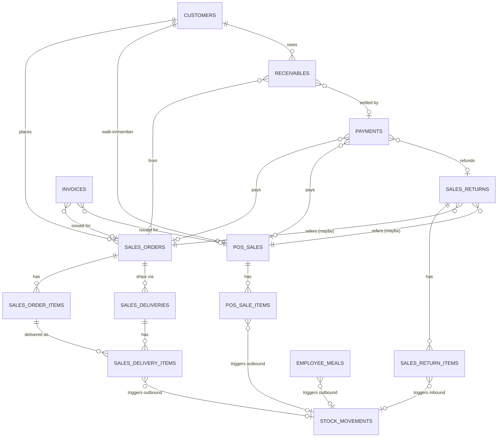

# 銷售模組 DB Schema v0.1

> 對應 [[PRD-銷售模組]] v0.1。
> 依賴 [[DB-庫存模組]] 的 `locations`、`stock_movements`、`rpc_outbound`、`rpc_inbound`。
> 純 DDL：`docs/sql/sales_schema.sql`

---

## 1. 表清單（14 張）

| # | 表名 | 角色 |
|---|---|---|
| 1 | `customers` | 客戶主檔（B2B / 散客 / 員工三型） |
| 2 | `customer_tier_prices` | 客戶階級價（P1）|
| 3 | `sales_orders` | B2B 銷售訂單頭 |
| 4 | `sales_order_items` | B2B 銷售明細 |
| 5 | `sales_deliveries` | 出貨單頭（一張 SO 可多次出貨） |
| 6 | `sales_delivery_items` | 出貨明細 |
| 7 | `pos_sales` | POS 現場交易單 |
| 8 | `pos_sale_items` | POS 明細 |
| 9 | `sales_returns` | 退貨單（B2B + POS 共用） |
| 10 | `sales_return_items` | 退貨明細 |
| 11 | `payments` | 付款紀錄（多付款方式） |
| 12 | `invoices` | 發票整合紀錄 |
| 13 | `receivables` | 應收帳款明細帳 |
| 14 | `employee_meals` | 員工餐紀錄 |

---

## 2. 設計原則

| 原則 | 說明 |
|---|---|
| **B2B 與 POS 分表** | 流程差異太大：SO 有分批出貨、月結；POS 即時結清。共表會塞太多 nullable 欄位 |
| **出貨才扣庫存** | B2B：`sales_deliveries` 確認才呼叫 `rpc_outbound`；POS：結帳即時呼叫 |
| **退貨共表** | `sales_returns.source_type` 區分 `sales_order` / `pos_sale`，用 `source_id` 指回 |
| **付款獨立表** | 一筆交易可多筆付款；每筆付款可關聯一個 sale（SO 或 POS） |
| **發票整合** | 只存參照（發票號碼 + 狀態），實際開立走舊系統 API |
| **應收 = 明細帳** | 用 `receivables` 記每筆「增加」與「沖抵」，餘額由 SUM 計算；不存靜態餘額 |
| **員工餐特殊化** | 不開票、不走付款，月彙總產扣款清單 |
| **多租戶** | `tenant_id` 所有表 |

---

## 3. ERD（核心關係）



---

## 4. 狀態機

```
SO:      draft → confirmed → partially_shipped → shipped → invoiced → closed
                                                                 │
                                                                 └→ cancelled
DELIVERY:  draft → confirmed   (confirmed 才扣庫存)
POS:     pending → completed → (可轉) voided / refunded
RETURN:  draft → confirmed → refunded
INVOICE: pending → issued → (可轉) voided / allowance
RECEIVABLE: open → partially_settled → settled (金額扣到 0) / written_off
```

---

## 5. DDL（完整）

```sql
-- ============================================
-- Sales Module Schema v0.1
-- 需先建好 inventory_schema.sql
-- ============================================

-- ---------- 1. 客戶主檔 ----------
CREATE TABLE customers (
  id                BIGSERIAL PRIMARY KEY,
  tenant_id         UUID NOT NULL,
  code              TEXT NOT NULL,
  name              TEXT NOT NULL,
  type              TEXT NOT NULL CHECK (type IN ('b2b','walk_in','employee')),
  tax_id            TEXT,                              -- 統編
  tier              TEXT,                              -- 'A','B','C' or custom
  contact_name      TEXT,
  phone             TEXT,
  email             TEXT,
  address           TEXT,
  payment_terms     TEXT,                              -- 'net30','cod','prepaid','none'
  credit_limit      NUMERIC(18,2),
  employee_ref_id   BIGINT,                            -- 對應 HR 員工表（外模組）
  is_active         BOOLEAN NOT NULL DEFAULT TRUE,
  notes             TEXT,
  created_at        TIMESTAMPTZ NOT NULL DEFAULT NOW(),
  updated_at        TIMESTAMPTZ NOT NULL DEFAULT NOW(),
  UNIQUE (tenant_id, code)
);
COMMENT ON TABLE customers IS 'B2B 批發客戶、散客、員工（員工餐用）共用主檔';

-- ---------- 2. 客戶階級價（P1）----------
CREATE TABLE customer_tier_prices (
  tenant_id   UUID NOT NULL,
  tier        TEXT NOT NULL,
  sku_id      BIGINT NOT NULL,
  price       NUMERIC(18,4) NOT NULL,
  effective_from DATE,
  effective_to   DATE,
  PRIMARY KEY (tenant_id, tier, sku_id, COALESCE(effective_from, DATE '1900-01-01'))
);

-- ---------- 3. B2B 銷售訂單 ----------
CREATE TABLE sales_orders (
  id                BIGSERIAL PRIMARY KEY,
  tenant_id         UUID NOT NULL,
  so_no             TEXT NOT NULL,
  customer_id       BIGINT NOT NULL REFERENCES customers(id),
  source_location_id BIGINT NOT NULL REFERENCES locations(id),   -- 哪個倉出貨
  status            TEXT NOT NULL DEFAULT 'draft' CHECK (status IN (
                      'draft','confirmed','partially_shipped','shipped','invoiced','closed','cancelled'
                    )),
  order_date        DATE NOT NULL DEFAULT CURRENT_DATE,
  required_date     DATE,
  subtotal          NUMERIC(18,2) NOT NULL DEFAULT 0,
  discount          NUMERIC(18,2) NOT NULL DEFAULT 0,
  tax               NUMERIC(18,2) NOT NULL DEFAULT 0,
  total             NUMERIC(18,2) NOT NULL DEFAULT 0,
  payment_terms     TEXT,
  created_by        UUID NOT NULL,
  confirmed_at      TIMESTAMPTZ,
  notes             TEXT,
  created_at        TIMESTAMPTZ NOT NULL DEFAULT NOW(),
  updated_at        TIMESTAMPTZ NOT NULL DEFAULT NOW(),
  UNIQUE (tenant_id, so_no)
);

CREATE TABLE sales_order_items (
  id             BIGSERIAL PRIMARY KEY,
  so_id          BIGINT NOT NULL REFERENCES sales_orders(id) ON DELETE CASCADE,
  sku_id         BIGINT NOT NULL,
  qty_ordered    NUMERIC(18,3) NOT NULL CHECK (qty_ordered > 0),
  qty_shipped    NUMERIC(18,3) NOT NULL DEFAULT 0,
  qty_returned   NUMERIC(18,3) NOT NULL DEFAULT 0,
  unit_price     NUMERIC(18,4) NOT NULL,
  discount_amt   NUMERIC(18,2) NOT NULL DEFAULT 0,
  tax_rate       NUMERIC(5,4) NOT NULL DEFAULT 0.05,
  line_subtotal  NUMERIC(18,2) GENERATED ALWAYS AS (qty_ordered * unit_price - discount_amt) STORED,
  notes          TEXT
);

-- ---------- 4. 出貨單（B2B 分批出貨） ----------
CREATE TABLE sales_deliveries (
  id                  BIGSERIAL PRIMARY KEY,
  tenant_id           UUID NOT NULL,
  delivery_no         TEXT NOT NULL,
  so_id               BIGINT NOT NULL REFERENCES sales_orders(id),
  source_location_id  BIGINT NOT NULL REFERENCES locations(id),
  status              TEXT NOT NULL DEFAULT 'draft' CHECK (status IN ('draft','confirmed','cancelled')),
  delivery_date       DATE NOT NULL DEFAULT CURRENT_DATE,
  shipped_by          UUID,
  confirmed_at        TIMESTAMPTZ,
  notes               TEXT,
  created_at          TIMESTAMPTZ NOT NULL DEFAULT NOW(),
  updated_at          TIMESTAMPTZ NOT NULL DEFAULT NOW(),
  UNIQUE (tenant_id, delivery_no)
);

CREATE TABLE sales_delivery_items (
  id             BIGSERIAL PRIMARY KEY,
  delivery_id    BIGINT NOT NULL REFERENCES sales_deliveries(id) ON DELETE CASCADE,
  so_item_id     BIGINT REFERENCES sales_order_items(id),
  sku_id         BIGINT NOT NULL,
  qty_shipped    NUMERIC(18,3) NOT NULL CHECK (qty_shipped > 0),
  unit_price     NUMERIC(18,4) NOT NULL,
  movement_id    BIGINT REFERENCES stock_movements(id),
  notes          TEXT
);

-- ---------- 5. POS 交易 ----------
CREATE TABLE pos_sales (
  id                BIGSERIAL PRIMARY KEY,
  tenant_id         UUID NOT NULL,
  sale_no           TEXT NOT NULL,
  location_id       BIGINT NOT NULL REFERENCES locations(id),
  terminal_id       TEXT,
  customer_id       BIGINT REFERENCES customers(id),     -- NULL = 匿名散客
  status            TEXT NOT NULL DEFAULT 'pending' CHECK (status IN (
                      'pending','completed','voided','refunded'
                    )),
  subtotal          NUMERIC(18,2) NOT NULL DEFAULT 0,
  discount          NUMERIC(18,2) NOT NULL DEFAULT 0,
  tax               NUMERIC(18,2) NOT NULL DEFAULT 0,
  total             NUMERIC(18,2) NOT NULL DEFAULT 0,
  paid_amount       NUMERIC(18,2) NOT NULL DEFAULT 0,
  change_amount     NUMERIC(18,2) NOT NULL DEFAULT 0,
  buyer_tax_id      TEXT,                                 -- 統編
  carrier_type      TEXT,                                 -- 載具類型
  carrier_id        TEXT,                                 -- 載具號碼 / 自然人憑證
  donated_to        TEXT,                                 -- 捐贈碼
  invoice_id        BIGINT,                               -- FK 延後加
  completed_at      TIMESTAMPTZ,
  operator_id       UUID NOT NULL,
  notes             TEXT,
  created_at        TIMESTAMPTZ NOT NULL DEFAULT NOW(),
  updated_at        TIMESTAMPTZ NOT NULL DEFAULT NOW(),
  UNIQUE (tenant_id, sale_no)
);

CREATE TABLE pos_sale_items (
  id             BIGSERIAL PRIMARY KEY,
  sale_id        BIGINT NOT NULL REFERENCES pos_sales(id) ON DELETE CASCADE,
  sku_id         BIGINT NOT NULL,
  qty            NUMERIC(18,3) NOT NULL CHECK (qty > 0),
  unit_price     NUMERIC(18,4) NOT NULL,
  discount_amt   NUMERIC(18,2) NOT NULL DEFAULT 0,
  tax_rate       NUMERIC(5,4) NOT NULL DEFAULT 0.05,
  line_subtotal  NUMERIC(18,2) GENERATED ALWAYS AS (qty * unit_price - discount_amt) STORED,
  movement_id    BIGINT REFERENCES stock_movements(id),
  notes          TEXT
);

-- ---------- 6. 退貨單 ----------
CREATE TABLE sales_returns (
  id              BIGSERIAL PRIMARY KEY,
  tenant_id       UUID NOT NULL,
  return_no       TEXT NOT NULL,
  source_type     TEXT NOT NULL CHECK (source_type IN ('sales_order','pos_sale')),
  source_id       BIGINT NOT NULL,                     -- 指向 SO.id 或 POS_SALE.id
  customer_id     BIGINT REFERENCES customers(id),
  dest_location_id BIGINT NOT NULL REFERENCES locations(id),  -- 退回哪個倉
  status          TEXT NOT NULL DEFAULT 'draft' CHECK (status IN (
                    'draft','confirmed','refunded','cancelled'
                  )),
  return_date     DATE NOT NULL DEFAULT CURRENT_DATE,
  reason          TEXT,
  subtotal        NUMERIC(18,2) NOT NULL DEFAULT 0,
  tax             NUMERIC(18,2) NOT NULL DEFAULT 0,
  total           NUMERIC(18,2) NOT NULL DEFAULT 0,
  refund_amount   NUMERIC(18,2) NOT NULL DEFAULT 0,
  created_by      UUID NOT NULL,
  confirmed_at    TIMESTAMPTZ,
  notes           TEXT,
  created_at      TIMESTAMPTZ NOT NULL DEFAULT NOW(),
  updated_at      TIMESTAMPTZ NOT NULL DEFAULT NOW(),
  UNIQUE (tenant_id, return_no)
);

CREATE TABLE sales_return_items (
  id             BIGSERIAL PRIMARY KEY,
  return_id      BIGINT NOT NULL REFERENCES sales_returns(id) ON DELETE CASCADE,
  source_item_id BIGINT,                              -- 原 SO_item 或 POS_item 的 id
  sku_id         BIGINT NOT NULL,
  qty            NUMERIC(18,3) NOT NULL CHECK (qty > 0),
  unit_price     NUMERIC(18,4) NOT NULL,
  line_subtotal  NUMERIC(18,2) GENERATED ALWAYS AS (qty * unit_price) STORED,
  movement_id    BIGINT REFERENCES stock_movements(id),
  notes          TEXT
);

-- ---------- 7. 付款 ----------
CREATE TABLE payments (
  id                BIGSERIAL PRIMARY KEY,
  tenant_id         UUID NOT NULL,
  payment_no        TEXT NOT NULL,
  method            TEXT NOT NULL CHECK (method IN (
                      'cash','credit_card','line_pay','jko_pay','credit_sale','other'
                    )),
  amount            NUMERIC(18,2) NOT NULL CHECK (amount <> 0),  -- 負數 = 退款
  direction         TEXT NOT NULL CHECK (direction IN ('in','out')),  -- in=收款、out=退款
  -- 關聯（二選一或其一可為 NULL）
  sales_order_id    BIGINT REFERENCES sales_orders(id),
  pos_sale_id       BIGINT REFERENCES pos_sales(id),
  sales_return_id   BIGINT REFERENCES sales_returns(id),
  receivable_id     BIGINT,                               -- FK 延後加
  -- 明細
  card_type         TEXT,                                 -- VISA/Master/JCB...
  auth_code         TEXT,                                 -- 刷卡授權碼
  tx_ref            TEXT,                                 -- 電支交易號
  status            TEXT NOT NULL DEFAULT 'completed' CHECK (status IN ('pending','completed','failed','refunded')),
  paid_at           TIMESTAMPTZ NOT NULL DEFAULT NOW(),
  operator_id       UUID,
  notes             TEXT,
  UNIQUE (tenant_id, payment_no),
  CHECK (
    (sales_order_id IS NOT NULL)::int
    + (pos_sale_id IS NOT NULL)::int
    + (sales_return_id IS NOT NULL)::int
    + (receivable_id IS NOT NULL)::int
    >= 1
  )
);

-- ---------- 8. 發票（沿用舊系統，本表只存參照） ----------
CREATE TABLE invoices (
  id              BIGSERIAL PRIMARY KEY,
  tenant_id       UUID NOT NULL,
  invoice_no      TEXT,                                   -- 舊系統產生的發票字軌 + 號碼
  invoice_type    TEXT NOT NULL CHECK (invoice_type IN ('b2b_triplicate','b2c_duplicate','allowance','voided')),
  issue_date      DATE,
  buyer_tax_id    TEXT,
  carrier_type    TEXT,
  carrier_id      TEXT,
  subtotal        NUMERIC(18,2) NOT NULL DEFAULT 0,
  tax             NUMERIC(18,2) NOT NULL DEFAULT 0,
  total           NUMERIC(18,2) NOT NULL DEFAULT 0,
  status          TEXT NOT NULL DEFAULT 'pending' CHECK (status IN ('pending','issued','voided','allowance')),
  source_type     TEXT NOT NULL CHECK (source_type IN ('sales_order','pos_sale','sales_return')),
  source_id       BIGINT NOT NULL,
  external_ref    TEXT,                                   -- 舊系統 / API 回傳的識別
  issued_at       TIMESTAMPTZ,
  voided_at       TIMESTAMPTZ,
  notes           TEXT,
  created_at      TIMESTAMPTZ NOT NULL DEFAULT NOW(),
  updated_at      TIMESTAMPTZ NOT NULL DEFAULT NOW(),
  UNIQUE (tenant_id, invoice_no)
);

-- 補 FK
ALTER TABLE pos_sales
  ADD CONSTRAINT fk_pos_invoice FOREIGN KEY (invoice_id) REFERENCES invoices(id);

-- ---------- 9. 應收帳款明細帳 ----------
CREATE TABLE receivables (
  id              BIGSERIAL PRIMARY KEY,
  tenant_id       UUID NOT NULL,
  customer_id     BIGINT NOT NULL REFERENCES customers(id),
  source_type     TEXT NOT NULL CHECK (source_type IN ('sales_order','sales_return','manual')),
  source_id       BIGINT,
  direction       TEXT NOT NULL CHECK (direction IN ('debit','credit')),  -- debit=增加應收、credit=沖抵
  amount          NUMERIC(18,2) NOT NULL CHECK (amount > 0),
  balance_after   NUMERIC(18,2),                          -- 該客戶該筆之後的累計餘額（快照）
  due_date        DATE,
  settled_by_payment_id BIGINT REFERENCES payments(id),   -- credit 時填
  status          TEXT NOT NULL DEFAULT 'open' CHECK (status IN ('open','partially_settled','settled','written_off')),
  notes           TEXT,
  created_at      TIMESTAMPTZ NOT NULL DEFAULT NOW()
);
COMMENT ON TABLE receivables IS '應收明細帳：每筆增加 (debit) / 沖抵 (credit) 各一列';

ALTER TABLE payments
  ADD CONSTRAINT fk_payment_receivable FOREIGN KEY (receivable_id) REFERENCES receivables(id);

-- ---------- 10. 員工餐 ----------
CREATE TABLE employee_meals (
  id              BIGSERIAL PRIMARY KEY,
  tenant_id       UUID NOT NULL,
  employee_id     BIGINT NOT NULL,                        -- 對應 HR
  location_id     BIGINT NOT NULL REFERENCES locations(id),
  meal_date       DATE NOT NULL DEFAULT CURRENT_DATE,
  sku_id          BIGINT NOT NULL,
  qty             NUMERIC(18,3) NOT NULL CHECK (qty > 0),
  unit_price      NUMERIC(18,4) NOT NULL DEFAULT 0,       -- 可為 0
  total           NUMERIC(18,2) GENERATED ALWAYS AS (qty * unit_price) STORED,
  movement_id     BIGINT REFERENCES stock_movements(id),
  payroll_batch   TEXT,                                   -- 月扣款批次 'YYYY-MM'
  notes           TEXT,
  created_at      TIMESTAMPTZ NOT NULL DEFAULT NOW()
);
```

---

## 6. RPC：關鍵寫入函式

### 6.1 POS 結帳完成 → 扣庫存 + 寫付款 + 發票參照

```sql
CREATE OR REPLACE FUNCTION rpc_complete_pos_sale(
  p_sale_id   BIGINT,
  p_operator  UUID
) RETURNS VOID AS $$
DECLARE
  v_sale RECORD;
  v_item RECORD;
  v_mov_id BIGINT;
BEGIN
  SELECT * INTO v_sale FROM pos_sales WHERE id = p_sale_id FOR UPDATE;
  IF v_sale.status <> 'pending' THEN
    RAISE EXCEPTION 'POS sale % is not pending (status=%)', p_sale_id, v_sale.status;
  END IF;

  -- 1. 每項呼叫 rpc_outbound 扣庫存
  FOR v_item IN SELECT * FROM pos_sale_items WHERE sale_id = p_sale_id LOOP
    v_mov_id := rpc_outbound(
      p_tenant_id       => v_sale.tenant_id,
      p_location_id     => v_sale.location_id,
      p_sku_id          => v_item.sku_id,
      p_quantity        => v_item.qty,
      p_movement_type   => 'sale',
      p_source_doc_type => 'pos_sale',
      p_source_doc_id   => p_sale_id,
      p_operator        => p_operator
    );
    UPDATE pos_sale_items SET movement_id = v_mov_id WHERE id = v_item.id;
  END LOOP;

  -- 2. 標記完成
  UPDATE pos_sales
     SET status = 'completed',
         completed_at = NOW(),
         updated_at = NOW()
   WHERE id = p_sale_id;

  -- 3. 發票：另行由 application 層呼叫舊系統 API 後 UPDATE invoice_id
END;
$$ LANGUAGE plpgsql SECURITY DEFINER;
```

### 6.2 出貨單確認 → 扣庫存 + 更新 SO

```sql
CREATE OR REPLACE FUNCTION rpc_confirm_delivery(
  p_delivery_id BIGINT,
  p_operator UUID
) RETURNS VOID AS $$
DECLARE
  v_dlv RECORD;
  v_item RECORD;
  v_mov_id BIGINT;
  v_so RECORD;
  v_fully BOOLEAN;
BEGIN
  SELECT * INTO v_dlv FROM sales_deliveries WHERE id = p_delivery_id FOR UPDATE;
  IF v_dlv.status <> 'draft' THEN
    RAISE EXCEPTION 'Delivery % is not draft', p_delivery_id;
  END IF;

  FOR v_item IN SELECT * FROM sales_delivery_items WHERE delivery_id = p_delivery_id LOOP
    v_mov_id := rpc_outbound(
      p_tenant_id       => v_dlv.tenant_id,
      p_location_id     => v_dlv.source_location_id,
      p_sku_id          => v_item.sku_id,
      p_quantity        => v_item.qty_shipped,
      p_movement_type   => 'sale',
      p_source_doc_type => 'sales_delivery',
      p_source_doc_id   => p_delivery_id,
      p_operator        => p_operator
    );
    UPDATE sales_delivery_items SET movement_id = v_mov_id WHERE id = v_item.id;

    IF v_item.so_item_id IS NOT NULL THEN
      UPDATE sales_order_items
         SET qty_shipped = qty_shipped + v_item.qty_shipped
       WHERE id = v_item.so_item_id;
    END IF;
  END LOOP;

  UPDATE sales_deliveries SET status = 'confirmed', confirmed_at = NOW(), updated_at = NOW()
   WHERE id = p_delivery_id;

  -- 更新 SO 狀態
  SELECT so_id INTO v_so.so_id FROM sales_deliveries WHERE id = p_delivery_id;
  SELECT BOOL_AND(qty_shipped >= qty_ordered) INTO v_fully
    FROM sales_order_items WHERE so_id = v_so.so_id;

  UPDATE sales_orders
     SET status = CASE WHEN v_fully THEN 'shipped' ELSE 'partially_shipped' END,
         updated_at = NOW()
   WHERE id = v_so.so_id AND status IN ('confirmed','partially_shipped');
END;
$$ LANGUAGE plpgsql SECURITY DEFINER;
```

### 6.3 退貨確認 → 入庫

```sql
CREATE OR REPLACE FUNCTION rpc_confirm_return(
  p_return_id BIGINT,
  p_operator UUID
) RETURNS VOID AS $$
DECLARE
  v_r RECORD; v_item RECORD; v_mov_id BIGINT;
BEGIN
  SELECT * INTO v_r FROM sales_returns WHERE id = p_return_id FOR UPDATE;
  IF v_r.status <> 'draft' THEN
    RAISE EXCEPTION 'Return % is not draft', p_return_id;
  END IF;

  FOR v_item IN SELECT * FROM sales_return_items WHERE return_id = p_return_id LOOP
    v_mov_id := rpc_inbound(
      p_tenant_id       => v_r.tenant_id,
      p_location_id     => v_r.dest_location_id,
      p_sku_id          => v_item.sku_id,
      p_quantity        => v_item.qty,
      p_unit_cost       => v_item.unit_price,     -- 以售價回帳，或改用成本快照
      p_movement_type   => 'customer_return',
      p_source_doc_type => 'sales_return',
      p_source_doc_id   => p_return_id,
      p_operator        => p_operator
    );
    UPDATE sales_return_items SET movement_id = v_mov_id WHERE id = v_item.id;
  END LOOP;

  UPDATE sales_returns SET status = 'confirmed', confirmed_at = NOW(), updated_at = NOW()
   WHERE id = p_return_id;
END;
$$ LANGUAGE plpgsql SECURITY DEFINER;
```

### 6.4 掛帳 → 產生應收

```sql
CREATE OR REPLACE FUNCTION rpc_book_receivable(
  p_tenant_id UUID,
  p_customer_id BIGINT,
  p_source_type TEXT,
  p_source_id BIGINT,
  p_amount NUMERIC,
  p_due_date DATE
) RETURNS BIGINT AS $$
DECLARE v_id BIGINT;
BEGIN
  INSERT INTO receivables
    (tenant_id, customer_id, source_type, source_id, direction, amount, due_date, status)
  VALUES
    (p_tenant_id, p_customer_id, p_source_type, p_source_id, 'debit', p_amount, p_due_date, 'open')
  RETURNING id INTO v_id;
  RETURN v_id;
END;
$$ LANGUAGE plpgsql SECURITY DEFINER;
```

### 6.5 收款沖帳

```sql
CREATE OR REPLACE FUNCTION rpc_settle_receivable(
  p_receivable_id BIGINT,
  p_payment_id BIGINT,
  p_amount NUMERIC
) RETURNS VOID AS $$
DECLARE
  v_r RECORD; v_settled NUMERIC;
BEGIN
  SELECT * INTO v_r FROM receivables WHERE id = p_receivable_id FOR UPDATE;
  IF v_r.status = 'settled' THEN
    RAISE EXCEPTION 'Receivable already settled';
  END IF;

  INSERT INTO receivables
    (tenant_id, customer_id, source_type, source_id, direction, amount,
     settled_by_payment_id, status)
  VALUES
    (v_r.tenant_id, v_r.customer_id, 'sales_order', v_r.source_id, 'credit', p_amount,
     p_payment_id, 'open');

  -- 計算該 debit 被沖抵的總額
  SELECT COALESCE(SUM(amount),0) INTO v_settled
    FROM receivables
   WHERE customer_id = v_r.customer_id
     AND source_type = v_r.source_type
     AND source_id = v_r.source_id
     AND direction = 'credit';

  UPDATE receivables
     SET status = CASE
       WHEN v_settled >= v_r.amount THEN 'settled'
       ELSE 'partially_settled' END
   WHERE id = p_receivable_id;

  UPDATE payments SET receivable_id = p_receivable_id WHERE id = p_payment_id;
END;
$$ LANGUAGE plpgsql SECURITY DEFINER;
```

### 6.6 員工取餐 → 扣庫存 + 記錄

```sql
CREATE OR REPLACE FUNCTION rpc_log_employee_meal(
  p_tenant_id UUID,
  p_employee_id BIGINT,
  p_location_id BIGINT,
  p_sku_id BIGINT,
  p_qty NUMERIC,
  p_unit_price NUMERIC,
  p_operator UUID
) RETURNS BIGINT AS $$
DECLARE v_id BIGINT; v_mov_id BIGINT;
BEGIN
  v_mov_id := rpc_outbound(
    p_tenant_id => p_tenant_id,
    p_location_id => p_location_id,
    p_sku_id => p_sku_id,
    p_quantity => p_qty,
    p_movement_type => 'sale',
    p_source_doc_type => 'employee_meal',
    p_source_doc_id => NULL,
    p_operator => p_operator
  );

  INSERT INTO employee_meals
    (tenant_id, employee_id, location_id, sku_id, qty, unit_price, movement_id,
     payroll_batch)
  VALUES
    (p_tenant_id, p_employee_id, p_location_id, p_sku_id, p_qty, p_unit_price, v_mov_id,
     to_char(NOW(),'YYYY-MM'))
  RETURNING id INTO v_id;

  RETURN v_id;
END;
$$ LANGUAGE plpgsql SECURITY DEFINER;
```

---

## 7. 索引

```sql
CREATE INDEX idx_so_customer_date  ON sales_orders (tenant_id, customer_id, order_date DESC);
CREATE INDEX idx_so_status         ON sales_orders (tenant_id, status);
CREATE INDEX idx_soi_so            ON sales_order_items (so_id);
CREATE INDEX idx_dlv_so            ON sales_deliveries (so_id, status);

CREATE INDEX idx_pos_location_time ON pos_sales (tenant_id, location_id, created_at DESC);
CREATE INDEX idx_pos_status        ON pos_sales (tenant_id, status);
CREATE INDEX idx_pos_operator_date ON pos_sales (location_id, operator_id, DATE(created_at AT TIME ZONE 'Asia/Taipei'));

CREATE INDEX idx_sr_source         ON sales_returns (source_type, source_id);
CREATE INDEX idx_sr_date           ON sales_returns (tenant_id, return_date DESC);

CREATE INDEX idx_pay_method_date   ON payments (tenant_id, method, paid_at DESC);
CREATE INDEX idx_pay_pos           ON payments (pos_sale_id) WHERE pos_sale_id IS NOT NULL;
CREATE INDEX idx_pay_so            ON payments (sales_order_id) WHERE sales_order_id IS NOT NULL;

CREATE INDEX idx_inv_source        ON invoices (source_type, source_id);

CREATE INDEX idx_ar_customer_open  ON receivables (tenant_id, customer_id, status)
  WHERE status IN ('open','partially_settled');

CREATE INDEX idx_meal_emp_month    ON employee_meals (tenant_id, employee_id, payroll_batch);
```

---

## 8. 常見查詢

```sql
-- 1. 某店當日銷售彙總
SELECT COUNT(*) AS txns, SUM(total) AS revenue
FROM pos_sales
WHERE tenant_id = $1
  AND location_id = $2
  AND DATE(created_at AT TIME ZONE 'Asia/Taipei') = CURRENT_DATE
  AND status = 'completed';

-- 2. 當日付款方式分佈
SELECT method, SUM(amount) AS amt, COUNT(*) AS cnt
FROM payments
WHERE tenant_id = $1
  AND direction = 'in'
  AND DATE(paid_at AT TIME ZONE 'Asia/Taipei') = CURRENT_DATE
GROUP BY method;

-- 3. 某客戶應收餘額
SELECT customer_id,
       SUM(CASE direction WHEN 'debit' THEN amount ELSE -amount END) AS balance
FROM receivables
WHERE tenant_id = $1 AND customer_id = $2 AND status <> 'written_off'
GROUP BY customer_id;

-- 4. 應收老化
SELECT customer_id,
       SUM(CASE WHEN due_date >= CURRENT_DATE - 30 THEN amount ELSE 0 END) AS d30,
       SUM(CASE WHEN due_date BETWEEN CURRENT_DATE - 60 AND CURRENT_DATE - 31 THEN amount ELSE 0 END) AS d60,
       SUM(CASE WHEN due_date < CURRENT_DATE - 60 THEN amount ELSE 0 END) AS over60
FROM receivables
WHERE tenant_id = $1 AND direction = 'debit' AND status IN ('open','partially_settled')
GROUP BY customer_id;

-- 5. 員工餐月扣款清單
SELECT employee_id, SUM(total) AS deduct
FROM employee_meals
WHERE tenant_id = $1 AND payroll_batch = $2
GROUP BY employee_id
ORDER BY deduct DESC;
```

---

## 9. RLS（摘要）

```sql
ALTER TABLE customers ENABLE ROW LEVEL SECURITY;
-- ... 其餘略（套用「tenant + 本 location 可見」模式）

-- 店員：只看本店 POS
CREATE POLICY pos_store_scope ON pos_sales
  FOR ALL USING (
    tenant_id = (auth.jwt() ->> 'tenant_id')::uuid
    AND location_id = (auth.jwt() ->> 'location_id')::bigint
  );

-- 業務：看自己負責的 B2B 客戶（若 customers 有 owner_id 擴充）
-- 會計 / 老闆：tenant 全讀
```

---

## 10. Open Questions

### Schema 影響
- [ ] **Q1 散客是否建客戶列**：所有 POS 都掛同一 customer_id=walk-in，還是不掛（`customer_id IS NULL`）？目前設計：可 NULL
- [ ] **Q2 信用額度檢查**：在 confirm SO 時檢查還是 delivery 時？超額硬擋還是只警示？
- [ ] **Q3 應收是否按「訂單」還是按「發票」結帳**：台灣常見是「發票對帳」，若是 → `receivables.source_type` 應加 `invoice`
- [ ] **Q4 成本快照**：退貨 inbound 的 unit_cost 目前用「原售價」，建議改用「原銷售當下的 avg_cost 快照」以免擾動庫存成本 — 要追加 `pos_sale_items.unit_cost` 欄位存成本快照
- [ ] **Q5 POS 離線同步**：離線暫存表設計 → v1 先略，或在 application 層處理？
- [ ] **Q6 多幣別**：目前單一 TWD，若有外幣客戶要加 currency
- [ ] **Q7 員工主檔**：與 HR 模組如何對接？`customers.employee_ref_id` 指向哪張 HR 表？

### 業務整合
- [ ] **Q8 舊發票系統 API 合約**：需文件確認欄位對應
- [ ] **Q9 刷卡機 / EDC 串接**：TCP? HTTP? 授權碼怎麼拿
- [ ] **Q10 LinePay / 街口 API**：commerce id、沙盒測試環境
- [ ] **Q11 日結差異規則**：短溢多少以內算可容忍？

---

## 11. 下一步
- [ ] 套 schema 到 Supabase dev
- [ ] 寫 seed：3 客戶 + 1 SO + 2 deliveries + 10 POS + 2 returns + 5 員工餐 → 驗證完整流程
- [ ] POS 結帳延遲壓測（目標 < 3s 含發票 API）
- [ ] 回答 Q1~Q11 → v0.2

---

## 相關連結
- [[PRD-銷售模組]]
- [[DB-庫存模組]] — 本模組依賴 `rpc_outbound` / `rpc_inbound`
- [[DB-進貨模組]] — 退貨轉退供的整合
- [[PRD-條碼模組]] — POS 掃碼
- 純 DDL：`docs/sql/sales_schema.sql`
